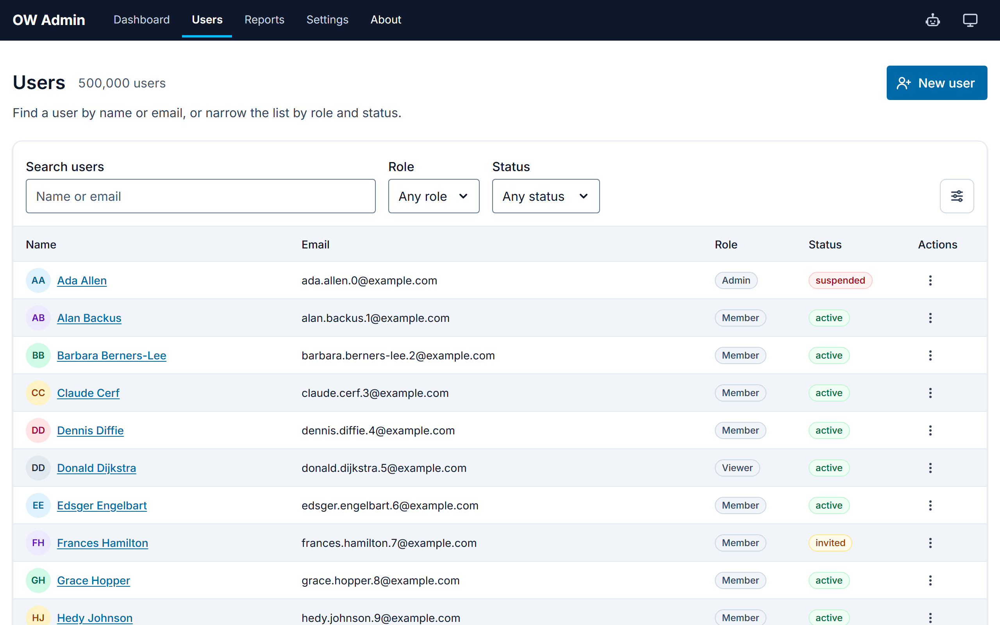
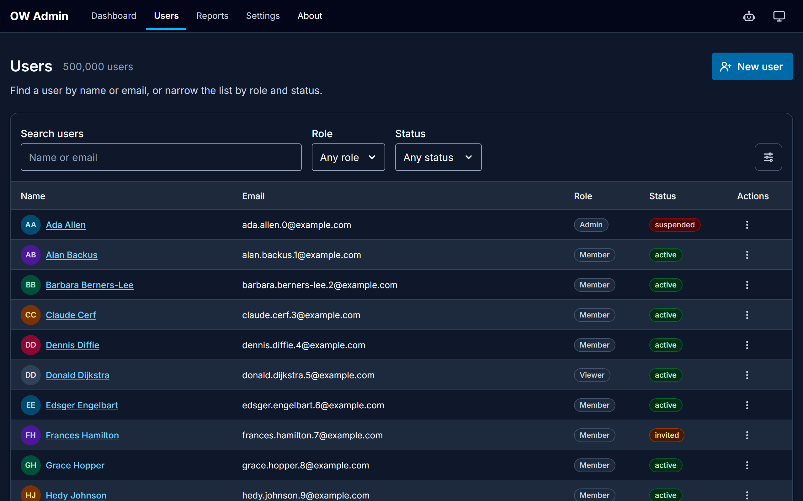
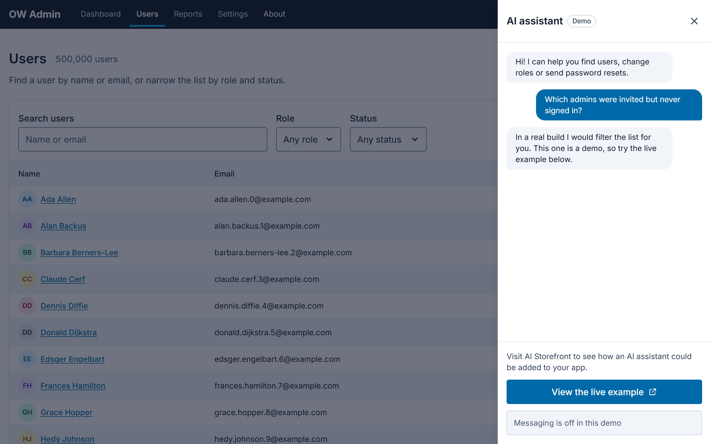
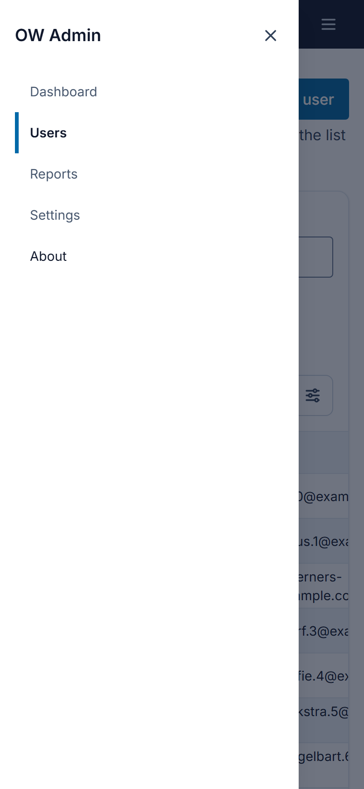

# OW Admin

OW Admin is an admin UI for managing users. It has a top navigation bar, a paged list of 500,000 users, screens to create, view and edit a user, and an About page. The app runs entirely in the browser: a client-side API layer answers HTTP requests from an in-memory store, so there is no backend to start. The app shows its name as "OW Admin" in the header and the browser tab.

It uses Angular 22 (standalone components, signals, Signal Forms, zoneless), Tailwind CSS 4, and AG Grid Community for the list.

The live app is at [ow.bobdempsey83.com](https://ow.bobdempsey83.com).

## Screenshots

The user list in the light theme:



The user list in the dark theme:



The demo AI assistant drawer, opened from the robot icon in the header:



The navigation drawer on a phone-width window:



## Running the app

Install dependencies, then start the dev server:

```bash
npm install
npm start
```

Open `http://localhost:4200/`. The app redirects to the user list at `/users`.

## Screens

- `/users` lists users 25, 50 or 100 at a time. Each page is one request to the API. Click a row, or press Enter on a focused row, to open that user. Click a column header, or press Enter on a focused one, to sort by it, and type in Search users to find people by name or email. The Role and Status dropdowns beside the search narrow the list to one role or status, and apply as soon as you choose.
  - Each active search or filter shows as a chip under the filters. Select a chip to remove that filter, or Clear all to remove every one in a single request. When nothing matches, the table card says so and offers Clear filters.
  - Status shows as a colored pill and role as a neutral pill, each with its word inside, and each name has a circle with the user's initials. While a page loads, the table shows placeholder rows.
  - Each row ends with an Actions button that opens a menu with View and Reset password. The button is not a Tab stop of its own: arrow to the row's Actions cell and press Enter or Space. Reset password asks first, then sends the email without reloading the list.
- `/users/new` creates a user. On success the app opens the new user's detail screen. New users take the next index, so they appear on the last page of the list.
- `/users/:id` shows a user as an editable form with Save and Cancel, with the user's initials in a colored circle beside their name. On a window 1024 pixels or wider the Password and Demo cards sit to the right of the form. Once a field differs from the saved value, Save and Cancel stay at the bottom of the window with the words "Unsaved changes", on windows at least 480 pixels tall. Its Reset password button sends the user a password reset email after you confirm, and leaves unsaved edits in the form.
- `/about` explains the app and how to try it.

Dashboard, Reports and Settings in the navigation are placeholders and do nothing.

The header stays dark in both themes. After the wordmark and the navigation entries it shows three icon buttons: AI assistant, Theme and, on narrow windows, Menu. Each icon button has a tooltip with its name.

On a window narrower than 768 pixels the navigation entries move into a drawer behind the Menu button, and the wordmark, AI assistant and Theme stay in the header. Choosing an entry navigates and closes the drawer; Escape, the X (Close) button and a click outside close it and put focus back on the Menu button.

The Theme button in the header shows the current choice's icon, and its name and tooltip say the choice, for example "Theme: Dark". It opens a menu of Light, Dark and System, with a check mark on the current choice. A choice applies as soon as you pick it, and the menu closes. System follows your OS color scheme and is the default. The app remembers your choice in this browser.

The AI assistant button opens a demo drawer from the right with a fixed sample conversation and a disabled message field. It sends nothing; its "View the live example" link opens [AI Storefront](https://ai-storefront.bobdempsey83.com/) in a new tab.

The app uses Inter as its typeface, served from the app itself (`@fontsource-variable/inter`), with tabular numbers for the user count and paging.

Table settings, an icon button at the top-right of the table card across from Search users, opens a dialog with five settings for the user table: Striped rows (on by default), Density (Comfortable or Compact, Compact by default), Draggable columns, Resizable columns and Fixed header. Changes apply at once and are remembered in this browser. Draggable columns and Resizable columns are off by default because dragging is then the only way to move a column, and the only single-pointer way to change a width, which fails WCAG 2.5.7; the dialog says so when you turn either on. The X button beside the dialog's heading closes it, and so does Escape.

## How the API layer works

The typed client is `UsersApi` in `src/app/core/api/`. It calls `HttpClient`, and `inMemoryApiInterceptor` answers every request under `/api` with a real `HttpResponse` or `HttpErrorResponse`, including status codes and headers.

| Method and path                           | Result                                                                                                                                                                                                                                      |
| ----------------------------------------- | ------------------------------------------------------------------------------------------------------------------------------------------------------------------------------------------------------------------------------------------- |
| `GET /api/users?skip&limit`               | 200 with `items` and `total`. `limit` defaults to 25 and is capped at 100.                                                                                                                                                                  |
| `GET /api/users?sort=name:asc`            | Added beyond the PDF contract. Sorts by `name`, `email`, `role` or `status`, `asc` or `desc`, ignoring case, ties by id. 400 for any other value.                                                                                           |
| `GET /api/users?q=text`                   | Added beyond the PDF contract. Only users whose name or email contains the text, ignoring case, with `total` counting the matches. Combines with `sort`, `skip` and `limit`. 400 over 100 characters.                                       |
| `GET /api/users?role=Admin&status=active` | Added beyond the PDF contract. Only users with that exact role or status, with `total` counting them. Values are case-sensitive and an empty value filters nothing. Combines with `q`, `sort`, `skip` and `limit`. 400 for any other value. |
| `GET /api/users/{id}`                     | 200 with an `ETag`, or 404.                                                                                                                                                                                                                 |
| `POST /api/users`                         | 201 with `ETag` and `Location`, or 400 with `fieldErrors`.                                                                                                                                                                                  |
| `PUT /api/users/{id}`                     | 200 with a new `ETag`. 428 without `If-Match`, 412 when the `If-Match` ETag is stale, 400 on invalid fields.                                                                                                                                |
| `POST /api/users/{id}/password-reset`     | 204. The detail screen's Reset password button calls it.                                                                                                                                                                                    |

Other methods on a known path return 405 with an `Allow` header.

The store generates the 500,000 seeded users (`u-000000` to `u-499999`) from their index when they are read, and keeps only created or edited users in memory, so a page costs the same at any offset. Every response waits 250 ms (`API_LATENCY_MS`) so loading states are visible. The store resets when you reload the page.

A user has a name, an email, a role (`Admin`, `Member` or `Viewer`) and a status (`active`, `invited` or `suspended`). Email uniqueness is not enforced.

## Trying an edit conflict

Updates use optimistic concurrency: the detail screen holds the user's ETag and sends it as `If-Match`. Because the store lives in one browser tab, the detail screen has a Demo section to produce a conflict:

1. Open any user, for example `/users/u-000042`.
2. Change a field, but do not save.
3. Select "Simulate an edit by another admin". This saves a change to the user's status behind the form, so the form's ETag goes stale.
4. Select Save. The API answers 412 and a dialog opens.

The dialog offers Keep editing (close it and keep your changes), Reload (discard your changes and show the latest version) and Overwrite (save your changes over the other edit).

## Requirements

The requirements live as OpenSpec specs in `openspec/specs/`. Completed changes, with their proposals, designs and task lists, are in `openspec/changes/archive/`.

## Building

```bash
npm run build
```

The build output goes to `dist/`.

## Formatting

Prettier formats the code, and `prettier-plugin-tailwindcss` sorts Tailwind class lists, including those in inline component templates. Check with `npx prettier --check src e2e`, or fix with `npx prettier --write src e2e`.

## Running unit tests

The unit tests run with [Vitest](https://vitest.dev/) in jsdom:

```bash
npm test
```

## Running accessibility tests

The browser accessibility suite runs Playwright and axe against the dev server, which it starts on port 4600. Stop anything already listening there first.

```bash
npm run test:a11y
```

The results and the WCAG 2.2 conformance report are in `docs/accessibility.md`.
